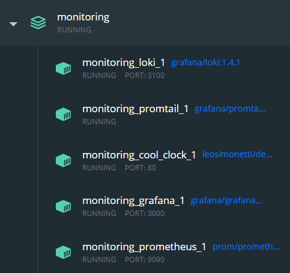
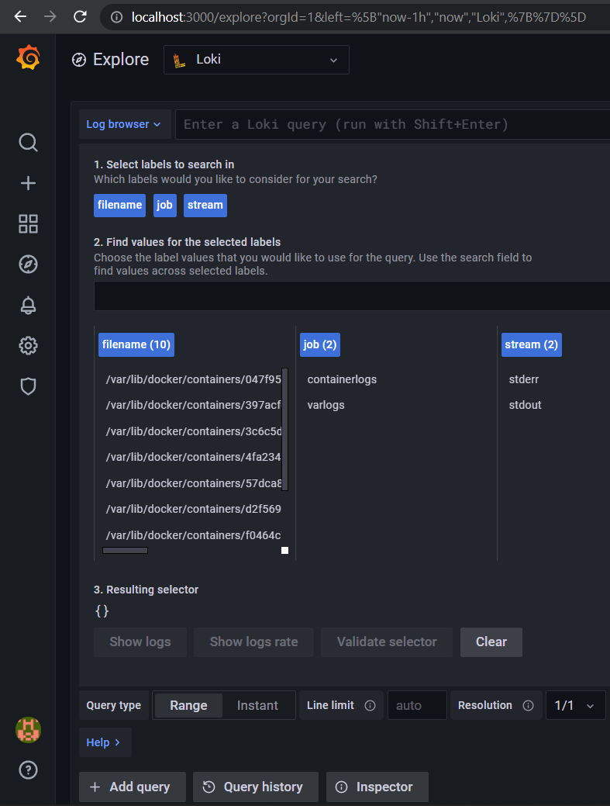

# Logging and Monitoring

## Hot to run

```shell
$ cd monitoring
$ sudo docker-compose up -d
```

## Loki Best practices

1. Static labels

> Bounded values that explicitly state the system/environment
> make the logs much more readable and logical.

2. Using dynamic labels sparringly
> Too many label value combinations leads to too many streams.
> The penalties for that in Loki are a large index and small chunks in the store, can actually reduce performance.

3. Bounding label values
> Loki might have problems handling labels with infinite/unbounded values

4. Making sure that Logs are in increasing time order per stream
> For any single log stream, logs must always be sent in increasing time order.
> If a log is received with a timestamp older than the most recent log received for that stream, that log will be dropped.

## Screenshots of success

### Docker Containers Running


### Grafana "Seeing" the Logs


