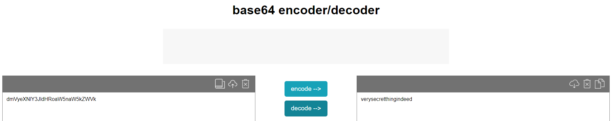

# Secrets

## Creating a secret
```shell
PS> kubectl create secret generic secretthings --from-literal=secrettext=verysecretthingindeed

secret/secretthings created
```

## Getting the secret
```shell
PS> kubectl get secret secretthings -o jsonpath='{.data}'

{"secrettext":"dmVyeXNlY3JldHRoaW5naW5kZWVk"}
```


## Using helm secrets
```shell
PS> kubectl exec aboba-66bdc7fc75-mh2rx -- printenv | grep SECRET
SECRET=verysecrettextnooneshouldnowever

```
