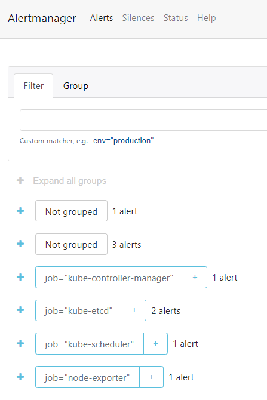

## Component description

- Prometheus Operator

> Provides tools for Prometheus configuration automation for kubernetes clusters

- Prometheus

> A service capable of collecting metrics from other services.

- Alertmanager

> Responsible for alerting metrics changes through different channels.

- Prometheus node-exporter

> Collects node metrics for prometheus

- Prometheus Adapter for Kubernetes Metrics APIs

> Connects prometheus and kubernetes

- kube-state-metrics

> Provides kubernetes metrics

- Grafana

> A metrics dashboard that can be integrated with Prometheus and other similar engines to display both logs and values.

## After installing the app

> The command gets all the

- **po**ds (po)
- **s**ta**t**eful **s**ets (sts)
- **s**er**v**i**c**es (svc)
- **p**ersistent **v**olume **c**laims (pvc)
- **c**onfig **m**aps (cm)

```shell
PS> kubectl get po,sts,svc,pvc,cm

NAME                                                         READY   STATUS    RESTARTS   AGE
pod/aboba-0                                                  1/1     Running   0          12h
pod/aboba-1                                                  1/1     Running   0          12h
pod/aboba-2                                                  1/1     Running   0          12h
pod/alertmanager-monitoring-kube-prometheus-alertmanager-0   2/2     Running   0          12h
pod/monitoring-grafana-5687c8b9fd-xqfdv                      2/2     Running   0          12h
pod/monitoring-kube-prometheus-operator-769f647f65-chxdt     1/1     Running   0          12h
pod/monitoring-kube-state-metrics-589766f6cb-fqjhq           1/1     Running   0          12h
pod/monitoring-prometheus-node-exporter-d7p64                1/1     Running   0          12h
pod/prometheus-monitoring-kube-prometheus-prometheus-0       2/2     Running   0          12h

NAME                                                                    READY   AGE
statefulset.apps/aboba                                                  3/3     12h
statefulset.apps/alertmanager-monitoring-kube-prometheus-alertmanager   1/1     12h
statefulset.apps/prometheus-monitoring-kube-prometheus-prometheus       1/1     12h

NAME                                              TYPE           CLUSTER-IP       EXTERNAL-IP   PORT(S)                      AGE
service/aboba                                     LoadBalancer   10.96.255.58     <pending>     5000:30830/TCP               12h
service/alertmanager-operated                     ClusterIP      None             <none>        9093/TCP,9094/TCP,9094/UDP   12h
service/kubernetes                                ClusterIP      10.96.0.1        <none>        443/TCP                      7d12h
service/monitoring-grafana                        ClusterIP      10.105.128.64    <none>        80/TCP                       12h
service/monitoring-kube-prometheus-alertmanager   ClusterIP      10.96.94.107     <none>        9093/TCP                     12h
service/monitoring-kube-prometheus-operator       ClusterIP      10.96.212.61     <none>        443/TCP                      12h
service/monitoring-kube-prometheus-prometheus     ClusterIP      10.101.49.90     <none>        9090/TCP                     12h
service/monitoring-kube-state-metrics             ClusterIP      10.104.161.20    <none>        8080/TCP                     12h
service/monitoring-prometheus-node-exporter       ClusterIP      10.104.213.242   <none>        9100/TCP                     12h
service/prometheus-operated                       ClusterIP      None             <none>        9090/TCP                     12h

NAME                                  STATUS   VOLUME                                     CAPACITY   ACCESS MODES   STORAGECLASS   AGE
persistentvolumeclaim/aboba-aboba-0   Bound    pvc-19a4dbcc-34f5-47cb-bd24-e795070eb5d6   64Mi       RWO            standard       12h
persistentvolumeclaim/aboba-aboba-1   Bound    pvc-b7e1b5ba-f340-4d4f-ade9-6c0add7dd958   64Mi       RWO            standard       12h
persistentvolumeclaim/aboba-aboba-2   Bound    pvc-44482359-d0fc-49d9-a52e-f441e427c491   64Mi       RWO            standard       12h

NAME                                                                     DATA   AGE
configmap/config.json                                                    1      12h
configmap/kube-prometheus-stack-19.0-alertmanager-overview               1      12h
configmap/kube-prometheus-stack-19.0-apiserver                           1      12h
configmap/kube-prometheus-stack-19.0-cluster-total                       1      12h
configmap/kube-prometheus-stack-19.0-controller-manager                  1      12h
configmap/kube-prometheus-stack-19.0-etcd                                1      12h
configmap/kube-prometheus-stack-19.0-grafana-datasource                  1      12h
configmap/kube-prometheus-stack-19.0-k8s-coredns                         1      12h
configmap/kube-prometheus-stack-19.0-k8s-resources-cluster               1      12h
configmap/kube-prometheus-stack-19.0-k8s-resources-namespace             1      12h
configmap/kube-prometheus-stack-19.0-k8s-resources-node                  1      12h
configmap/kube-prometheus-stack-19.0-k8s-resources-pod                   1      12h
configmap/kube-prometheus-stack-19.0-k8s-resources-workload              1      12h
configmap/kube-prometheus-stack-19.0-k8s-resources-workloads-namespace   1      12h
configmap/kube-prometheus-stack-19.0-kubelet                             1      12h
configmap/kube-prometheus-stack-19.0-namespace-by-pod                    1      12h
configmap/kube-prometheus-stack-19.0-namespace-by-workload               1      12h
configmap/kube-prometheus-stack-19.0-node-cluster-rsrc-use               1      12h
configmap/kube-prometheus-stack-19.0-node-rsrc-use                       1      12h
configmap/kube-prometheus-stack-19.0-nodes                               1      12h
configmap/kube-prometheus-stack-19.0-persistentvolumesusage              1      12h
configmap/kube-prometheus-stack-19.0-pod-total                           1      12h
configmap/kube-prometheus-stack-19.0-prometheus                          1      12h
configmap/kube-prometheus-stack-19.0-proxy                               1      12h
configmap/kube-prometheus-stack-19.0-scheduler                           1      12h
configmap/kube-prometheus-stack-19.0-statefulset                         1      12h
configmap/kube-prometheus-stack-19.0-workload-total                      1      12h
configmap/kube-prometheus-stack-19.0.1-grafana                           1      12h
configmap/kube-prometheus-stack-19.0.1-grafana-config-dashboards         1      12h
configmap/kube-prometheus-stack-19.0.1-grafana-test                      1      12h
configmap/kube-root-ca.crt                                               1      7d12h
configmap/monitoring-grafana                                             1      12h
configmap/monitoring-grafana-config-dashboards                           1      12h
configmap/monitoring-grafana-test                                        1      12h
configmap/monitoring-kube-prometheus-alertmanager-overview               1      12h
configmap/monitoring-kube-prometheus-apiserver                           1      12h
configmap/monitoring-kube-prometheus-cluster-total                       1      12h
configmap/monitoring-kube-prometheus-controller-manager                  1      12h
configmap/monitoring-kube-prometheus-etcd                                1      12h
configmap/monitoring-kube-prometheus-grafana-datasource                  1      12h
configmap/monitoring-kube-prometheus-k8s-coredns                         1      12h
configmap/monitoring-kube-prometheus-k8s-resources-cluster               1      12h
configmap/monitoring-kube-prometheus-k8s-resources-namespace             1      12h
configmap/monitoring-kube-prometheus-k8s-resources-node                  1      12h
configmap/monitoring-kube-prometheus-k8s-resources-pod                   1      12h
configmap/monitoring-kube-prometheus-k8s-resources-workload              1      12h
configmap/monitoring-kube-prometheus-k8s-resources-workloads-namespace   1      12h
configmap/monitoring-kube-prometheus-kubelet                             1      12h
configmap/monitoring-kube-prometheus-namespace-by-pod                    1      12h
configmap/monitoring-kube-prometheus-namespace-by-workload               1      12h
configmap/monitoring-kube-prometheus-node-cluster-rsrc-use               1      12h
configmap/monitoring-kube-prometheus-node-rsrc-use                       1      12h
configmap/monitoring-kube-prometheus-nodes                               1      12h
configmap/monitoring-kube-prometheus-persistentvolumesusage              1      12h
configmap/monitoring-kube-prometheus-pod-total                           1      12h
configmap/monitoring-kube-prometheus-prometheus                          1      12h
configmap/monitoring-kube-prometheus-proxy                               1      12h
configmap/monitoring-kube-prometheus-scheduler                           1      12h
configmap/monitoring-kube-prometheus-statefulset                         1      12h
configmap/monitoring-kube-prometheus-workload-total                      1      12h
configmap/prometheus-monitoring-kube-prometheus-prometheus-rulefiles-0   28     12h


```

## Available information

- CPU and Memory your StatefulSet is consuming
>  

- Which Pod is using CPU more than others and which is less in the default namespace.
> prometheus
  

- How much memory is used on your node, in % and mb.
>  

- How many pods and containers actually ran by the Kubelet service.
>  

- Which Pod is using network more than others and which is less in the default namespace.
> Either prometheus or grafana


- How many alerts you have
> 9 alerts total
> 

## Using an Init container

```shell
PS> kubectl exec pod/aboba-0 -- cat /papka/index.html

Defaulted container "aboba" out of: aboba, install (init)
<html><head></head><body><header>
<title>http://info.cern.ch</title>
</header>

<h1>http://info.cern.ch - home of the first website</h1>
<p>From here you can:</p>
<ul>
<li><a href="http://info.cern.ch/hypertext/WWW/TheProject.html">Browse the first website</a></li>
<li><a href="http://line-mode.cern.ch/www/hypertext/WWW/TheProject.html">Browse the first website using the line-mode browser simulator</a></li>
<li><a href="http://home.web.cern.ch/topics/birth-web">Learn about the birth of the web</a></li>
<li><a href="http://home.web.cern.ch/about">Learn about CERN, the physics laboratory where the web was born</a></li>
</ul>
</body></html>

```
